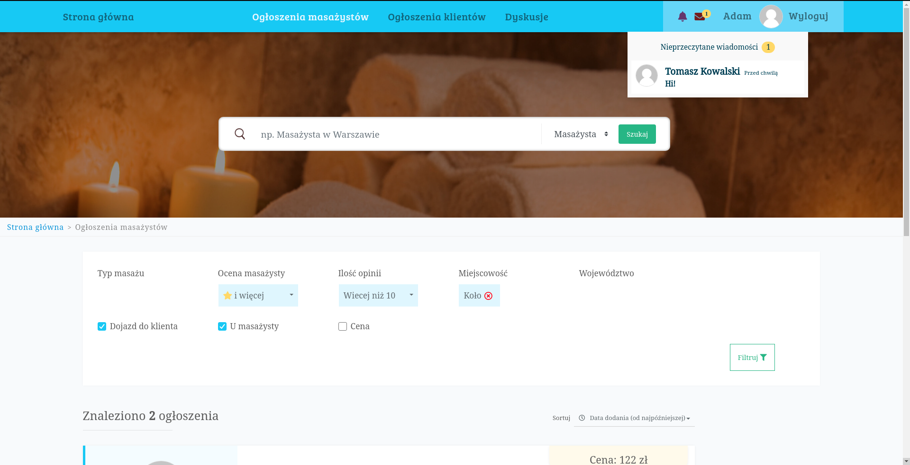

# Advertising portal for masseurs

As a side project in 2019 vacation, I created a functional advertising portal that can be used by clients to find masseurs and vice versa. Why masseurs? Because It was the first profession I found that had not had this kind of portal.

## Walkthrough

Check out the youtube walkthrough to see how the website looks like and its basics functionality:
[TODO link here]

## Functionality
- Masseurs can post an advertisement with their services.
- Potential clients can browse through advertisements using filters (location, rating of the masseur, number of ratings, price, if they can travel to clients).
- Clients can sort advertisements by price, dates of creation and opinion.
- When the client finds an ideal offer he can contact the masseur via a real-time in-build chat application.
- Masseurs get message notifications when someone contacts them and they can talk about the details of providing the service.
- Masseurs can upload information about their education, courses and experience.
- Clients can write opinions under masseurs advertisements and give them stars 1-5.

## Technologies
### Backend:
- Laravel PHP framework
- Mysql
- Redis
### Frontend:
- Vue.js
- Animate.css
### Real time functionality:
- Pusher

## Project status

Due to starting classes on university project development was stopped.

## Installation

Installation and configuration are a bit tricky and I don't think anyone will want to do it, but if you are really desperate (seriously?) contact me.

## License
[Mozilla Public License 2.0](https://choosealicense.com/licenses/mpl-2.0/)
